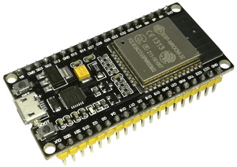
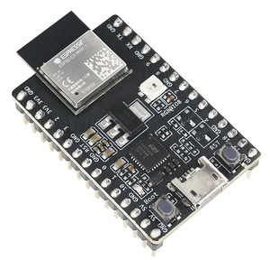
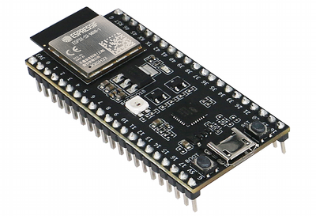
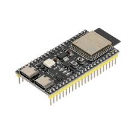

## Introducción
Thonny es un software de programación principalmente utilizado para conectar dispositivos con micropython.

## Instalación
1. Acceder a <https://thonny.org>

2. En la sección *Download* (descargas), hacer click en la versión correspondiente a su sistema operativo.

3. Ejecutar el archivo descargado, se iniciará un asistente de instalación que le guiará paso a paso. 

## Descarga de driver para Windows 

1. Acceder a <https://www.silabs.com/developers/usb-to-uart-bridge-vcp-drivers?tab=downloads>

2. Descargar el driver *CP210x Universal Windows Driver*

3. Guardarlo y descomprimirlo en una ubicación conocida y de fácil acceso.

4. Conectar la ESP32.

5. Abrir el *Administrador de dispositivos* y buscar el dispositivo que aparezca como desconocido o en la sección *otros*.

6. Dar doble click en este

7. Dar click en la opción *Actualizar controlador*

8. Dentro de la opción de controladores, seleccionar la opción de *Buscar controladores en mi equipo*

9. Dar click en *examinar*

10. Seleccionar la carpeta donde previamente se descomprimió el *CP210x Universal Windows Driver*

11. Una vez que termine el proceso de instalación, el controlador ya está instalado y el dispositivo listo para usarse.

## Instalar o Actualizar el firmware de Micropython

1. En el menú “Run”, seleccionar “Configure Interpreter...”

2. En la pestaña “Interpreter”, seleccionar "Install or update MicroPython (espool)"
3. Elegir el puerto correspondiente
4. Elegir el firmware que corresponda a la tarjeta de la familia MicroPython (ESP32, ESP32-S2, ESP32-S3 o ESP32-C3) y selecionar la variante "Espressif"

**ESP32** https://micropython.org/download/ESP32_GENERIC/

**ESP32 C3** https://micropython.org/download/ESP32_GENERIC_C3/

**ESP32-S2** https://micropython.org/download/ESP32_GENERIC_S2/

**ESP32-S3** https://micropython.org/download/ESP32_GENERIC_S3/

6. Click en "Instalar"
   

7. Presionar el botón de reinicio en la tarjeta y posteriormente presionar el botón de reinicio en thonny, al reiniciar ambos la tarjeta se conectará de manera automática.  

## Configuración para conectar a la ESP32
1. Abrir Thonny

2. En el menú *Run*, seleccionar *Configure Interpreter...*

3. En la pestaña *Interpreter*, seleccionar *Micropython (ESP32)* y el puerto correspondiente (en Windows aparece como *Silicon Labs CP210x USB to UART Bridge* o *Dispositivo serie USB (COM##)*.

4. Desactivar todas las opciones de la última sección, excepto *restart interpreter before running a script*

5. Click en OK

#### Estás listo para utilizar Tony

